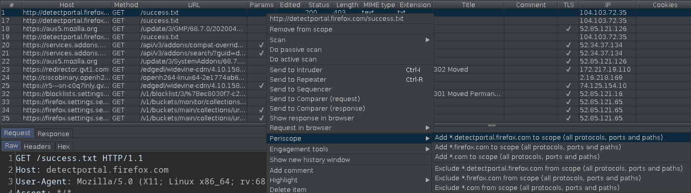

Quick scope settings for Burp Suite
===================================

Usage
-----

Select one or more HTTP messages (for example items in the top half of the
`HTTP history` tab within `Proxy`. Click with the right mouse button to open the
popup menu, and select `Periscope`. This will offer adding hostnames to the
scope with a wildcard at any possible subdomain.

Building
--------

Execute `./gradlew build` and you'll have the plugin ready in
`build/libs/burp-periscope.jar`

License
-------

The whole project is available under MIT license, see `LICENSE.txt`.
